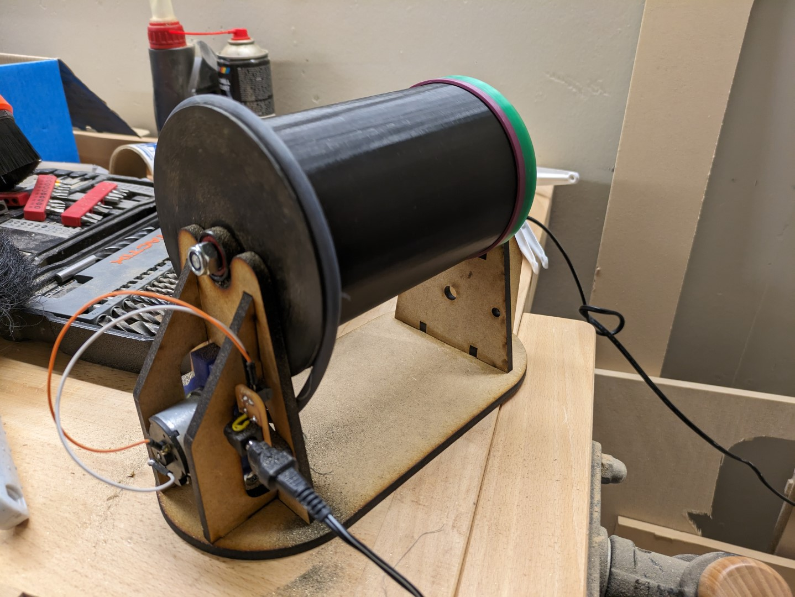

# Krukki

**_Krukki_** er Fab Lab smíðuð slípitromla (e. (rock) tumbler). 

Við ætlum að gera tilraun með að slípa 3D prentuð verk, til fá á þau fallega áferð. 

## *2023.10.19* - Uppfærsla

|  | 
|:--:| 
| *Krukki* |

*Video > [Krukki 24 tíma keyrsla](myndir/krukki.mkv)*

## Fusion 360 hönnun

TODO: Hlekkur

## KiCAD 

Teikning fyrir mótortengi má finna undir _krukki-psu_. 

|   Íhlutur                     |       | 
|   ---                         | ---   | 
|   [fab:TerminalBlock_OnShore_1x02_P3.50mm_Horizontal](www.on-shore.com/wp-content/uploads/ED555XDS.pdf)               | 1 | 
|   [fab:CUIDevices_PJ-002AH-SMT-TR_PWRJack_2x5.5mm](https://www.cuidevices.com/product/resource/pj-002ah-smt-tr.pdf)   | 1 |

## Mótor

[Jameco 253471](https://www.jameco.com/z/38-004-Jameco-ReliaPro-DC-Motor-with-Gearhead-12VDC-74mA-1120-RPM_253471.html)

## Skjöl

TODO: 3D skjöl

TODO: Laserskurðarskjöl